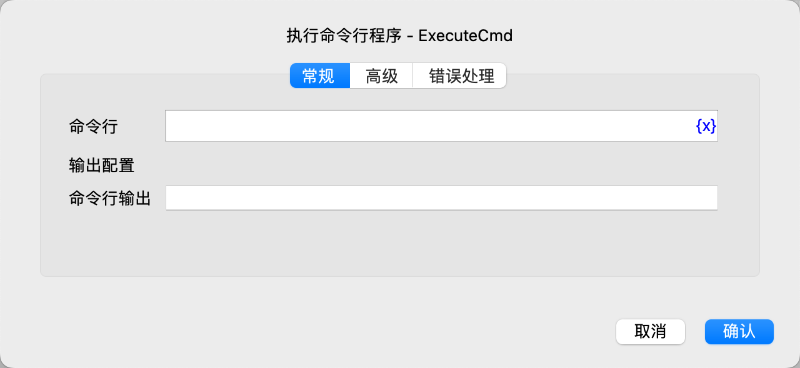
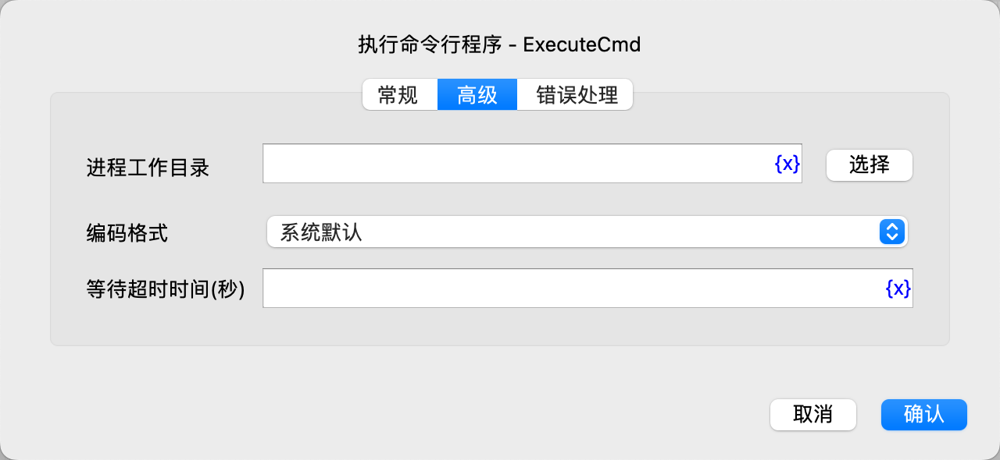

# 执行命令行程序

执行命令行程序。

## 指令配置

### 命令行

输入要执行的命令行。

### 命令行输出

输入用于保存命令行输出的变量名称。

### 进程工作目录

输入或选择命令行进程的工作目录。

### 编码格式

选择命令行输出的编码格式。

### 等待超时时间

输入命令行进程执行超时的时间，单位为秒，默认不限制。

### 错误处理

如果指令执行出错，则执行错误处理，详情参见[指令的错误处理](../../manual/error_handling.md)。
