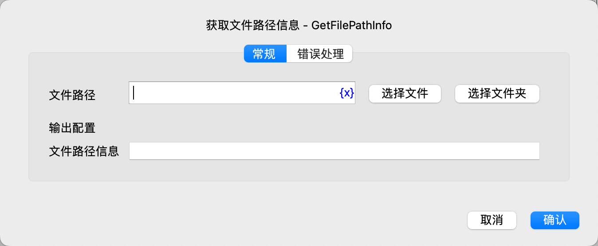

# 获取文件路径信息

获取文件路径信息。

## 指令配置

### 文件路径

输入或选择文件或文件夹的路径。

### 文件路径信息

输入用于保存文件路径信息对象的变量名。

文件路径信息对象具有如下属性：

* root：根目录
* parent：父目录
* name：文件名
* nameWithoutExtension：不带扩展名的文件名
* extension：文件扩展名
* exists：文件是否存在
* isDirectory：是否为文件夹
* isFile：是否为文件
* size：文件大小，单位字节
* ctime：创建时间，是一个时间戳，单位秒
* mtime：修改时间，是一个时间戳，单位秒

### 错误处理

如果指令执行出错，则执行错误处理，详情参见[指令的错误处理](../../manual/error_handling.md)。
