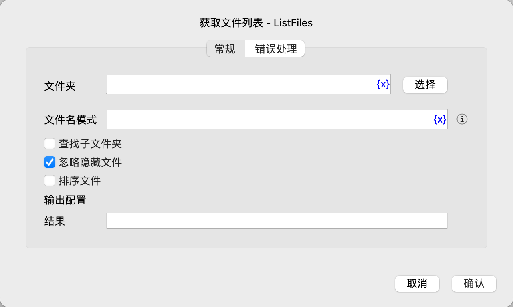

# 获取文件列表

获取指定文件夹下的文件列表。

## 指令配置

### 文件夹

输入或选择文件夹路径。

### 文件名模式

输入用于筛选文件名的模式。

文件名模式是由普通字符和通配符组成的特殊字符串，其中通配符的语法如下：

1. *：匹配零个或多个字符（包括文件名中的任何字符）。 

    例如：*.txt 匹配所有 .txt 文件。

2. ?：匹配一个字符。

    例如：file?.txt 匹配 file1.txt、fileA.txt 等，但不匹配 file.txt。

3. [...]：匹配方括号内的任意一个字符。

    例如：file[1-3].txt 匹配 file1.txt、file2.txt 和 file3.txt。

4. [!...]：匹配不在方括号内的任意一个字符。

    例如：file[!a-z].txt 匹配 file1.txt、file2.txt 和 file3.txt。

5. **：匹配零个或多个目录（可以跨越子目录）。

    例如：**/*.txt 匹配当前目录及所有子目录中的所有 .txt 文件。

### 查找子文件夹

启用此选项，将递归查找子文件夹。

### 忽略隐藏文件

启用此选项，将忽略隐藏文件。

### 排序文件

启用此选项，将对匹配的文件列表进行排序。

### 排序因素

如果启用了排序文件，则需要选择用于排序的因素，可选值有：文件名、文件大小、创建时间、最后修改时间。

### 排序方式

如果启用了排序文件，则需要选择排序方式，可选值有：升序、降序。

### 结果

输入用于保存查找到的文件路径列表的变量名。

### 错误处理

如果指令执行出错，则执行错误处理，详情参见[指令的错误处理](../../manual/error_handling.md)。
