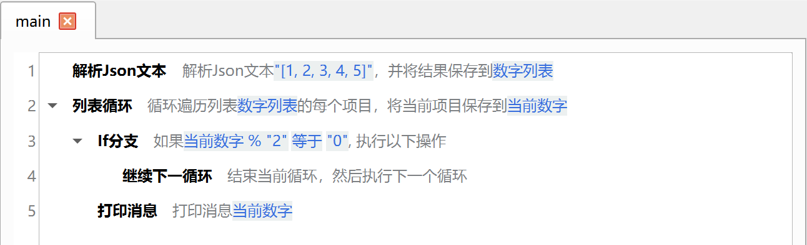
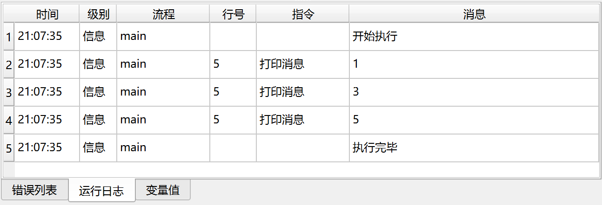

# 继续下一循环

用于在循环指令的循环体中跳过当前循环，继续执行下一循环。

## 指令配置

该指令没有配置参数。

## 使用示例

该流程用于打印列表中的所有奇数。

该流程的执行逻辑如下：

1. 解析JSON列表数据，并保存到变量“数字列表”中。
2. 循环遍历“数字列表”中的每个数字。
    1. 如果数字是偶数，则继续下一循环。
    2. 否则，打印当前数字。

运行日志：

