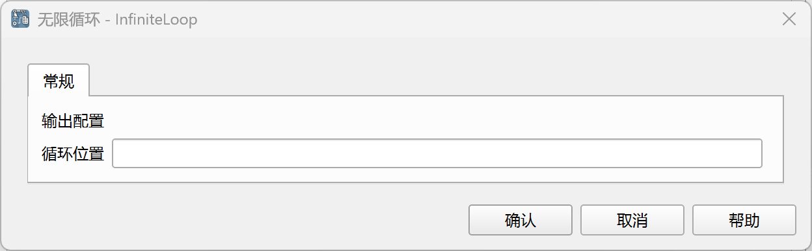
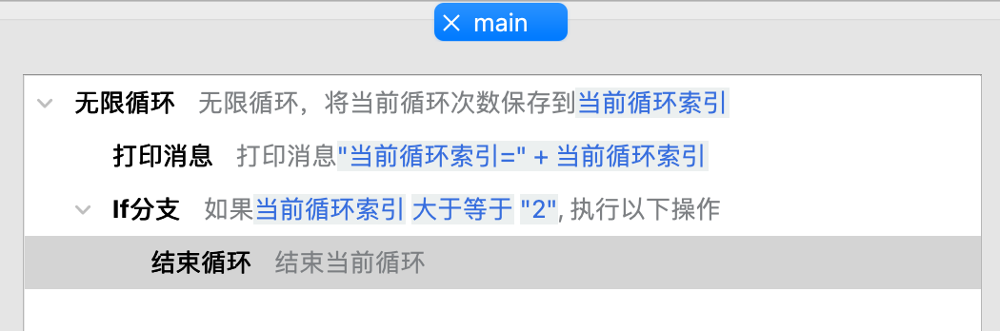
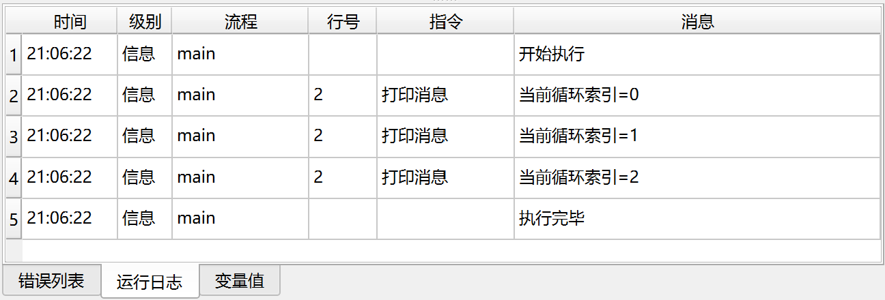

# 无限循环

无限循环执行包含的指令，直到在循环体中使用其他流程控制指令结束循环。

可以结束循环的指令包括：[返回](../return.md)、[终止应用](../exit.md)

## 指令配置

### 循环位置

输入用于保存当前循环索引位置的变量名，循环位置是一个从0开始的整数。

## 使用示例

该流程的执行逻辑如下：

1. 无限循环，将当前循环位置保存到变量“当前循环索引”中，然后执行循环内的指令。
    1. 打印“当前循环索引”的值
    2. 判断“当前循环索引”是否大于等于2，是则结束循环

运行日志：

应用下载地址：[无限循环示例应用](../../../examples/infinite_loop_demo.zip)
