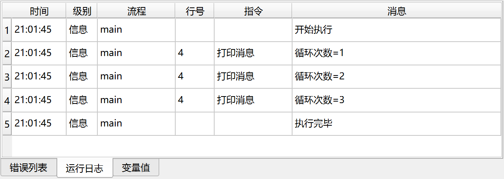

# 列表循环

循环遍历列表中的每一个元素，然后执行循环内的指令。

## 指令配置

### 列表

输入需要遍历的列表表达式。

### 循环项目

输入用于保存列表中元素的变量名。

## 使用示例

该流程的执行逻辑如下：

1. 解析JSON列表数据，并保存到变量“列表”中。
2. 循环遍历“列表”中的每个元素，将当前项目保存到变量“当前值”，然后执行循环内的指令。
    1. 打印变量“当前值”。

运行日志：

应用下载地址：[列表循环示例应用](../../../examples/list_loop_demo.zip)
