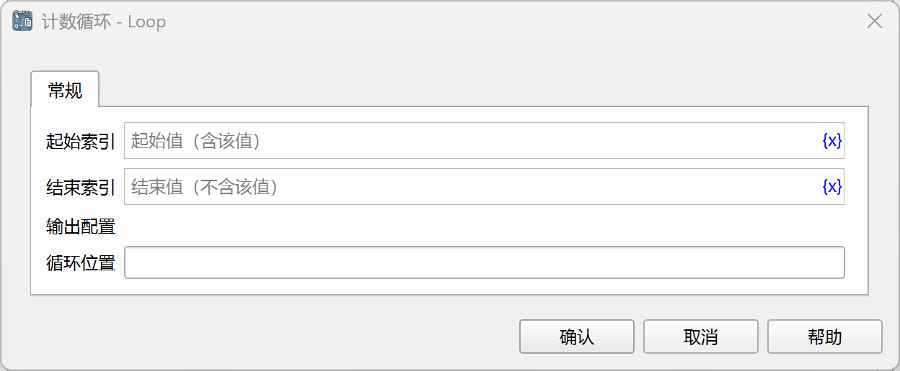

# 计数循环

在指定的计数范围内重复执行包含的指令。

## 指令配置

### 起始索引

循环的起始索引，包含该值，必须是整数，如“0”。

### 结束索引

循环的结束索引，不包含该值，必须是整数，如“10”。

## 使用示例

该流程的执行逻辑如下：

1. 从1（含）循环到5（不含），将当前循环次数保存到变量“当前索引”中。
    1. 在每一次循环中打印当前索引。

运行日志：

应用下载地址：[计数循环示例应用](../../../examples/loop_demo.zip)
