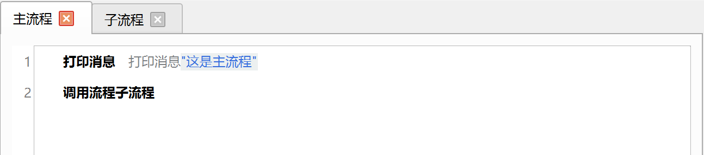
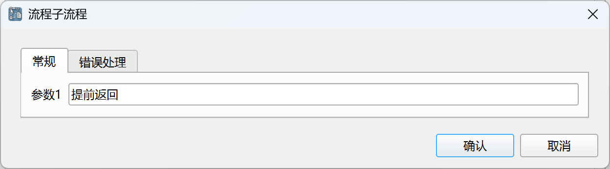
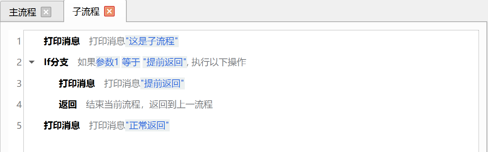
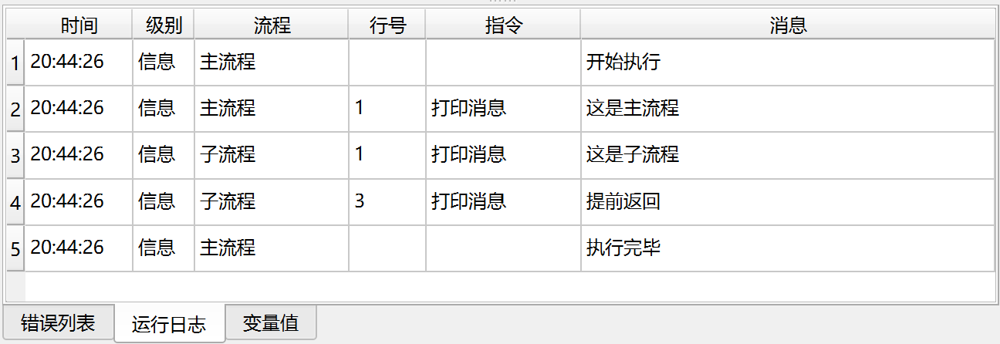

# 返回

对于复杂的应用，我们可以将应用分成多个流程，然后在父流程中调用子流程，该指令用于提前从子流程返回到父流程。

## 指令配置

该指令没有配置参数。

## 使用示例

主流程的执行逻辑：

1. 打印消息“这是主流程”。
2. 调用子流程，并将参数1设置为“提前返回”。

子流程的执行逻辑：

1. 判断参数1是否为“提前返回”，如果是，则打印消息并提前返回主流程。
2. 否则，打印消息并正常返回。

运行日志：

