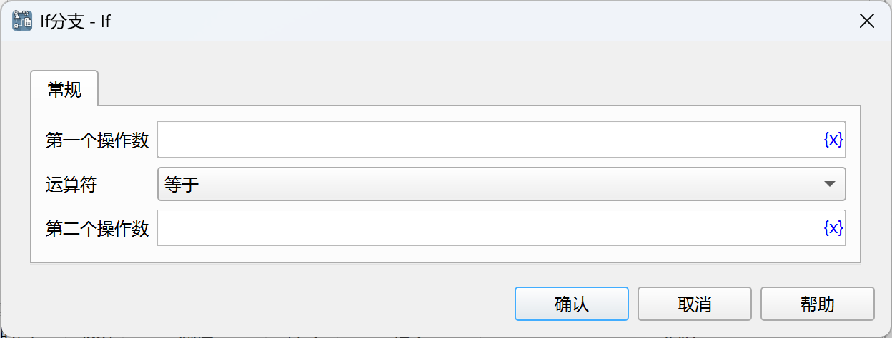
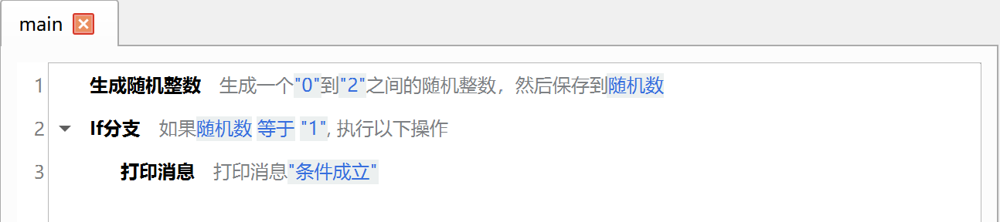

# If 分支

判断指定条件是否成立，如果成立，则执行包含的所有指令。

## 指令配置

### 第一个操作数

输入第一个操作数的表达式，如变量、字符串、数值等。

### 运算符

选择使用的比较运算符，当前支持如下运算符：等于、不等于、大于、小于、大于等于、小于等于、包含、不包含、为空、不为空、开头为、开头不为、结尾为、结尾不为、为真、为假、没有值、有值。

### 第二个操作数

除了为空、不为空、为真、为假、没有值、有值，其他运算符还需要输入第二个操作数。

## 使用示例

该流程的执行逻辑如下：

1. 生成一个0（含）到2（不含）之间的随机整数，然后保存到流程变量`随机数`中。
2. 判断流程变量`随机数`是否等于1，如果等于，则执行If 分支包含的指令，即打印消息“条件成立”。

多次执行流程，可以看到只有当`随机数`为1时，才会打印消息“条件成立”。

应用下载地址：[If 分支示例应用](../../../examples/if_demo.zip)
