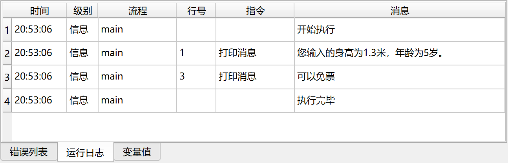

# If 多条件分支

同时判断多个条件是否满足指定关系，如果满足，则执行包含的所有指令。

## 指令配置

### 条件关系

选择多个条件之前的逻辑关系：满足所有条件、满足任意条件。

### 条件列表

配置条件列表，每个条件由操作数和运算符组成。

## 使用示例

该流程的执行逻辑如下：

1. 打印用户输入的身高和年龄。
2. 检查身高是否小于1.2米，或者年龄是否小于6岁，如果满足任一条件，则打印消息“可以免票”。
3. 否则，打印消息“需要购票”。

运行日志：

应用下载地址：[If 多条件分支示例应用](../../../examples/if_conditions_demo.zip)
