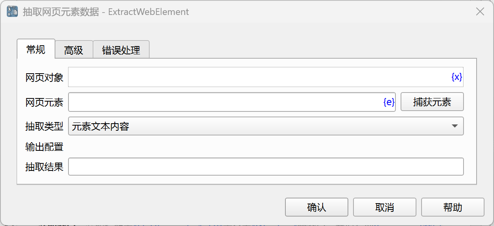
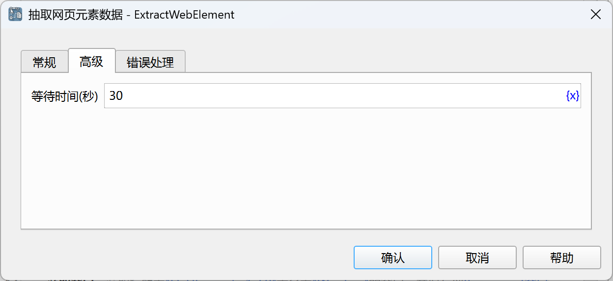

# 抽取网页元素数据

获取网页元素的各类数据，如元素内容、元素属性等。

## 指令配置

### 网页对象

选择要操作的网页对象。

### 网页元素

从元素库中选择一个网页元素，或者点击“捕获元素”按钮调用工具获取，详情请参见[网页元素捕获工具](../../../manual/web_element_capture_tool.md)。

### 抽取类型

- 元素文本内容：获取元素文本内容。
- 元素HTML源码：获取元素HTML源码。
- 输入框值：获取输入框的值。
- 链接地址：获取链接元素的地址。
- 元素属性值：获取指定属性的值。
- 元素位置：获取元素相当于网页左上角的坐标位置，单位为像素，抽取结果为一个字典，包含x、y两个字段。

### 属性名

当抽取类型为“元素属性值”时，输入要获取的属性名。

### 抽取结果

输入用于保存抽取结果的变量名。

### 等待时间

等待网页元素出现的时间，单位为秒。

### 错误处理

如果指令执行出错，则执行错误处理，详情参见[指令的错误处理](../../../manual/error_handling.md)。
