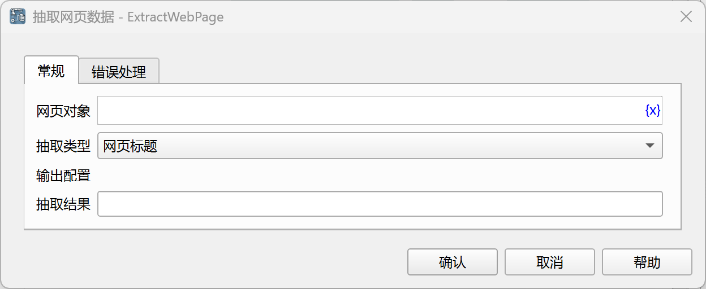

# 抽取网页数据

获取网页的标题、链接、内容等信息。

## 指令配置

### 网页对象

选择要操作的网页对象。

### 抽取类型

- 网页标题：获取网页的标题。
- 网页地址：获取网页的链接地址。
- 网页HTML源码：获取网页的HTML源码。
- 网页文本内容：获取网页的文本内容。

### 抽取结果

输入用于保存抽取结果的变量名。

### 错误处理

如果指令执行出错，则执行错误处理，详情参见[指令的错误处理](../../../manual/error_handling.md)。
