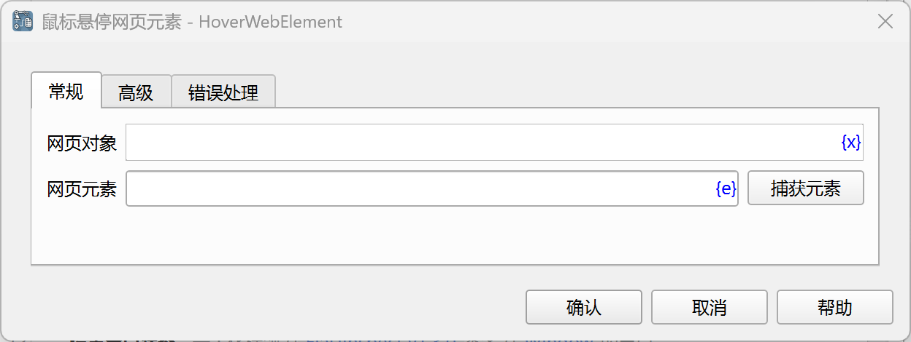
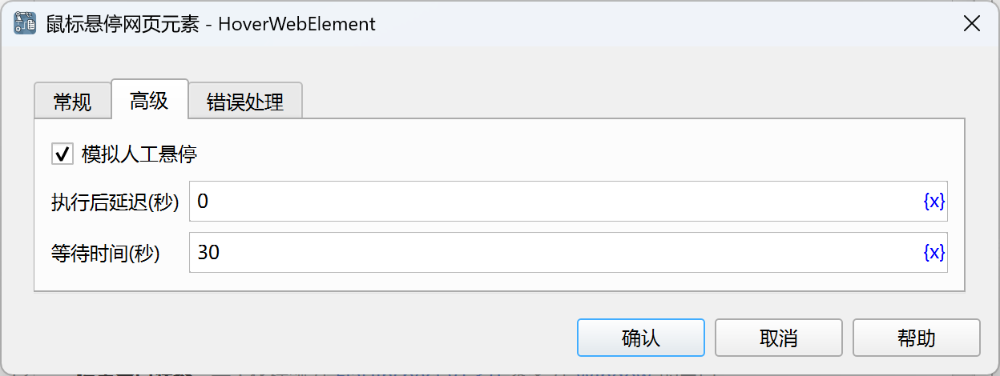

# 鼠标悬停网页元素

模拟鼠标悬停网页元素操作。

## 指令配置

### 网页对象

选择要操作的网页对象。

### 网页元素

从元素库中选择一个网页元素，或者点击“捕获元素”按钮调用工具获取，详情请参见[网页元素捕获工具](../../../manual/web_element_capture_tool.md)。

### 模拟人工悬停

如果勾选，则悬停的网页元素必须是单个元素，且必须是可见的，没有被遮挡，且处于启用状态。

### 执行后延迟

执行指令后，延迟一段时间再继续执行后续指令，单位为秒。

### 等待时间

等待网页元素出现的时间，单位为秒。

### 错误处理

如果指令执行出错，则执行错误处理，详情参见[指令的错误处理](../../../manual/error_handling.md)。
