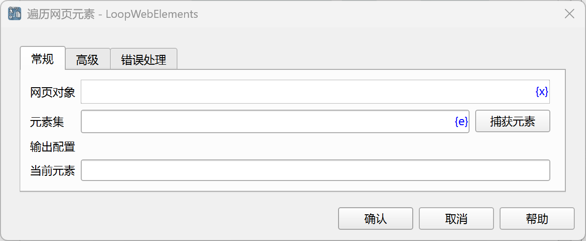
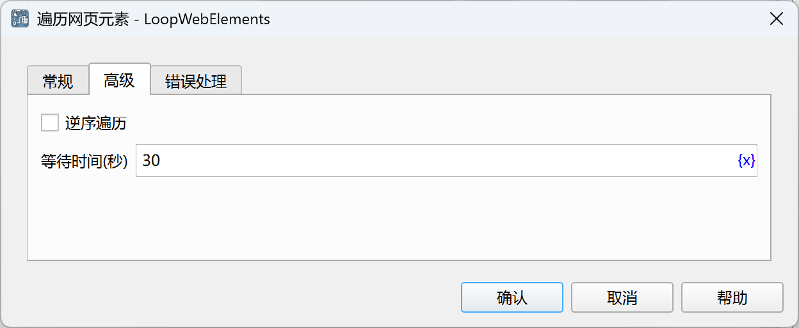

# 遍历网页元素

循环遍历多个网页元素，然后执行循环内的指令。

## 指令配置

### 网页对象

选择要操作的网页对象。

### 元素集

从元素库中选择一个网页相似元素列表，或者点击“捕获元素”按钮调用工具获取，详情请参见[网页元素捕获工具](../../../manual/web_element_capture_tool.md)。

### 当前元素

输入用于保存当前遍历元素Xpath的变量名，用于后续指令使用。

### 逆序遍历

选择是否逆序遍历。

### 等待时间

等待网页元素出现的时间，单位为秒。

### 错误处理

如果指令执行出错，则执行错误处理，详情参见[指令的错误处理](../../../manual/error_handling.md)。
