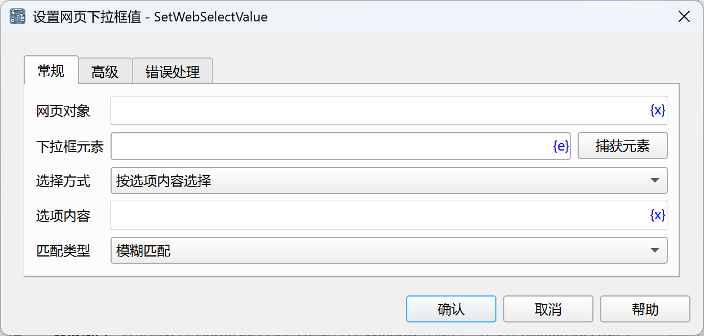
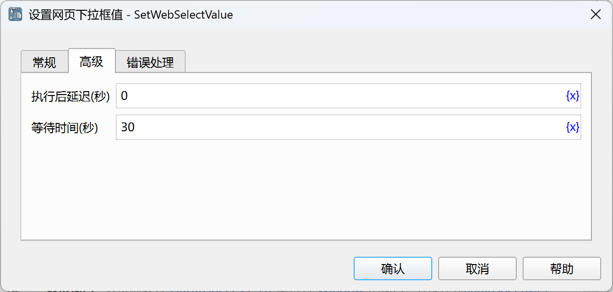

# 设置网页下拉框值

设置网页下拉框值。

## 指令配置

### 网页对象

选择要操作的网页对象。

### 下拉框元素

从元素库中选择一个网页下拉框元素，或者点击“捕获元素”按钮调用工具获取，详情请参见[网页元素捕获工具](../../../manual/web_element_capture_tool.md)。

### 选择方式

选择设置下拉框的方式，可选值有：按选项内容选择、按选项索引选择。

### 选项内容

如果选择按选项内容选择，则需要输入要选择的选项内容。

### 匹配类型

如果选择按选项内容选择，则需要选择选项内容匹配的方式，可选值有：模糊匹配、精确匹配、正则匹配。

### 选项索引

如果选择按选项索引选择，则需要输入要选择的选项索引，索引从0开始。

### 执行后延迟

执行指令后，延迟一段时间再继续执行后续指令，单位为秒。

### 等待时间

等待输入框出现的时间，单位为秒。

### 错误处理

如果指令执行出错，则执行错误处理，详情参见[指令的错误处理](../../../manual/error_handling.md)。
