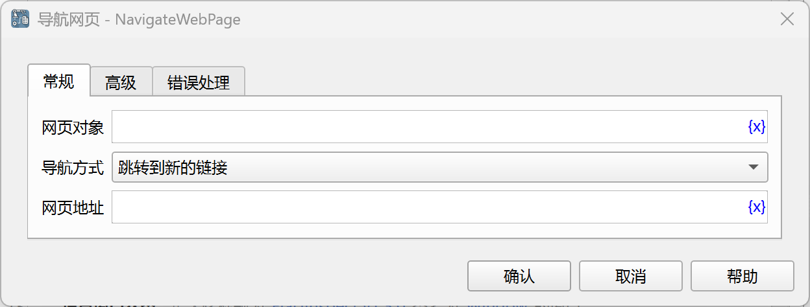
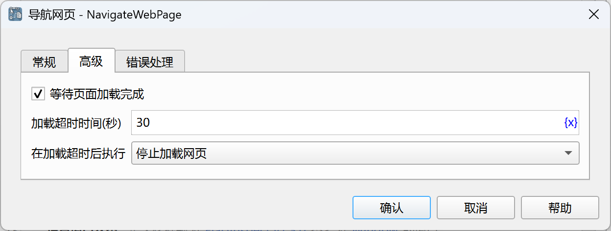

# 导航网页

将网页对象导航到新的网址。

## 指令配置

### 网页对象

选择要导航的网页对象。

### 导航方式

可以选择以下四种导航方式：
1. 跳转到新的链接
2. 后退
3. 前进
4. 刷新

### 网页地址

如果选择了跳转到新的链接，则输入要导航到的网址。

### 等待页面加载完成

导航之后，是否等待页面加载完成。

### 加载超时时间

等待页面加载完成的超时时间，单位为秒。

### 在加载超时后执行

加载超时之后的处理方法，可以停止加载网页，也可以执行错误处理。

### 错误处理

如果加载超时，或者指令执行出错，则执行错误处理，详情参见[指令的错误处理](../../../manual/error_handling.md)。
