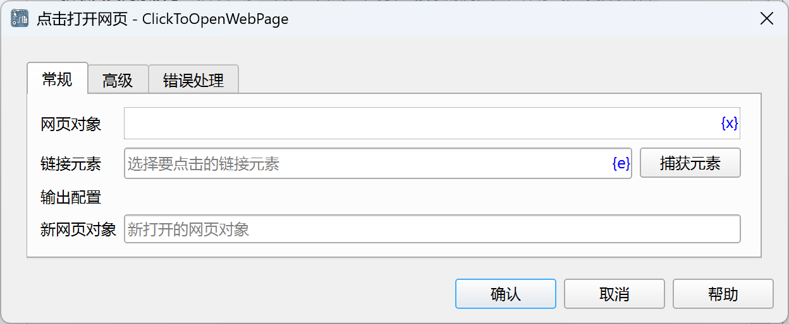
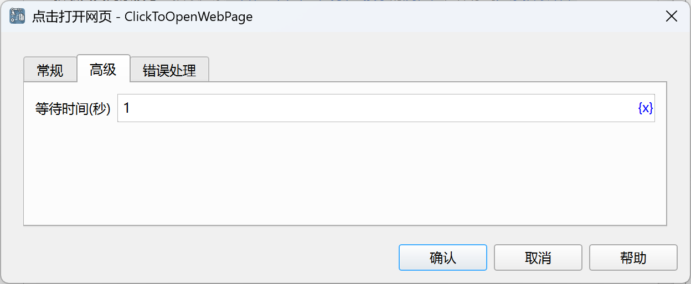

# 点击打开网页

点击网页上的链接以打开一个新网页，并将新打开的网页对象保存到流程变量中。

对于在当前窗口打开的链接，请直接使用[点击网页元素](WebElementOperation/click_web_element.md)指令，不要使用该指令，该指令专门用于点击打开新窗口的情况。

## 指令配置

### 网页对象

选择要点击的链接所在的网页对象。

### 链接元素

从元素库中选择一个链接元素，或者点击“捕获元素”按钮调用工具获取，详情请参见[网页元素捕获工具](../../manual/web_element_capture_tool.md)。

### 新网页对象

输入用于保存新打开的网页对象的流程变量名称。

### 等待时间

等待弹出新网页窗口的时间，默认1秒。

### 错误处理

如果指令执行出错，则执行错误处理，详情参见[指令的错误处理](../../manual/error_handling.md)。
