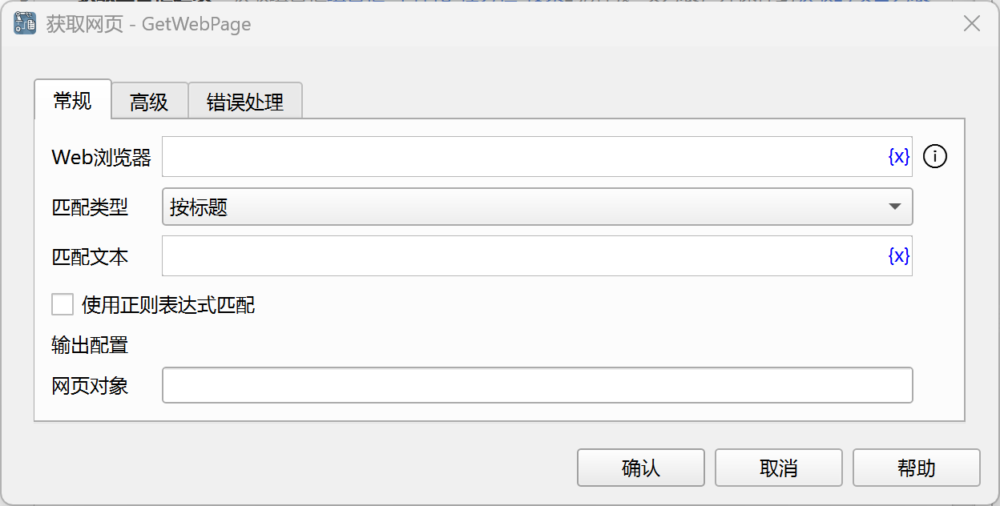
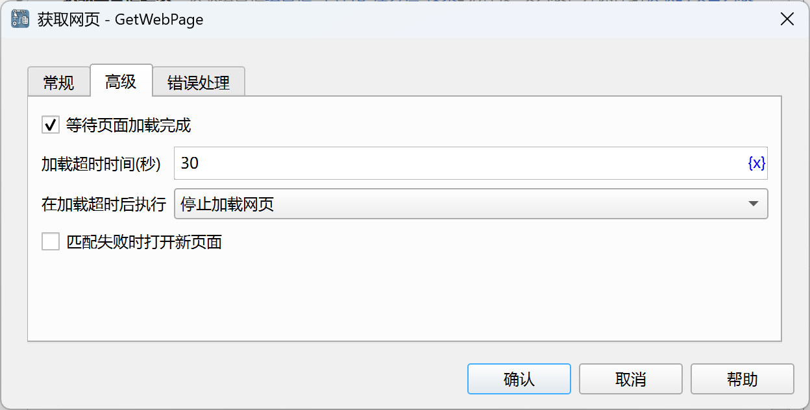

# 获取网页

在当前打开的浏览器中查找指定的网页。

## 指令配置

### Web浏览器

选择要在哪个浏览器中查找网页。

### 匹配类型

可以按标题查找网页，也可以按URL查找网页，也可以获取当前活动的网页。

### 匹配文本

输入需要匹配的标题或链接文本。

### 使用正则表达式匹配

如果勾选该选项，则匹配文本将作为正则表达式。

### 网页对象

输入用于保存找到的网页对象的流程变量名称。

### 等待页面加载完成

是否等待页面加载完成。

### 加载超时时间

等待页面加载完成的超时时间。

### 在加载超时后执行

在加载超时后执行的处理策略，可以停止加载网页，也可以执行错误处理。

### 匹配失败时打开新页面

如果匹配失败，是否打开新的网页。

### 网页地址

输入要打开的网页地址。

### 错误处理

如果未找到网页，或者指令执行出错，则执行错误处理，详情参见[指令的错误处理](../../manual/error_handling.md)。
