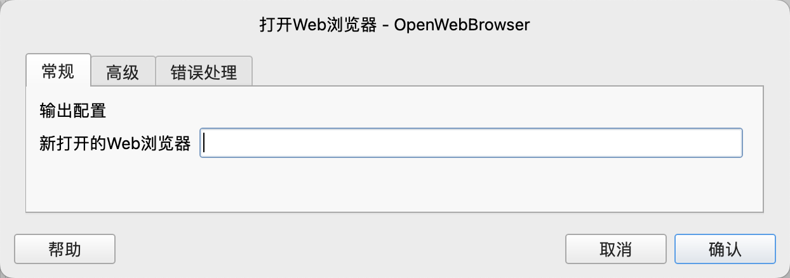
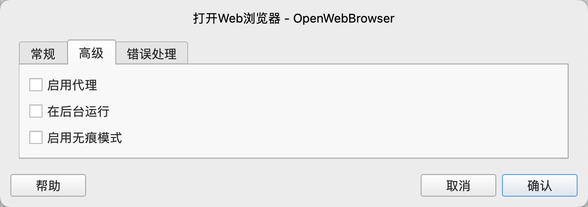

# 打开Web浏览器

打开网页浏览器。

## 指令配置

### 新打开的Web浏览器
输入用于保存新打开的Web浏览器的流程变量名称。

### 启用代理
配置是否启用代理。

### 代理服务器地址
输入代理服务器地址。

支持 HTTP 和 SOCKS 代理，例如 http://myproxy.com:3128 或 socks5://myproxy.com:3128。
简写形式 myproxy.com:3128 被视为 HTTP 代理。

### 忽略代理的域
输入以逗号分隔的无需使用代理的域名，例如 “.com, chromium.org, .domain.com”。

### 代理服务器用户名
输入代理服务器的用户名。

### 代理服务器密码
输入代理服务器的密码。

### 在后台运行
配置是否在后台运行网络浏览器。

### 启用无痕模式
配置是否启用浏览器的无痕模式。

### 错误处理

如果指令执行出错，则执行错误处理，详情参见[指令的错误处理](../../manual/error_handling.md)。
