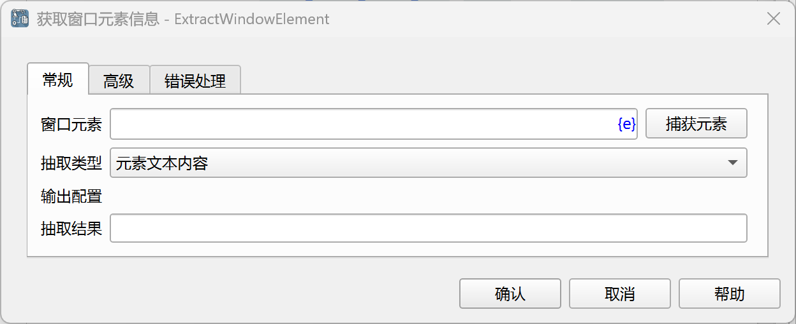
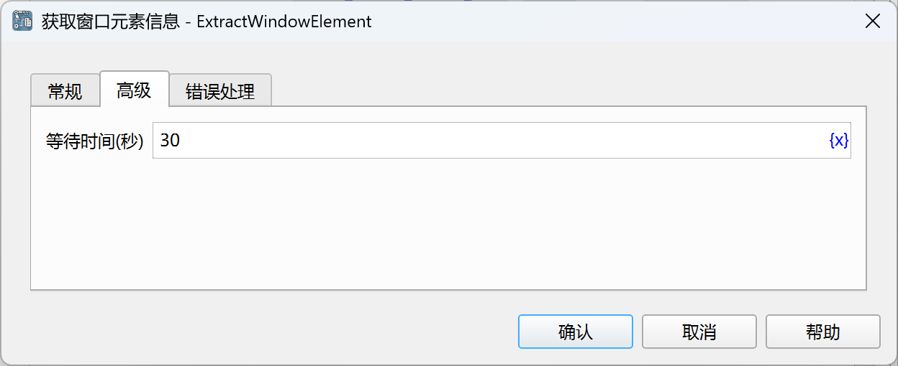

# 获取窗口元素信息

获取窗口元素的各类数据，如元素内容、元素属性等。

## 指令配置

### 窗口元素

从元素库中选择一个窗口元素，或者点击“捕获元素”按钮调用工具获取，详情请参考[窗口元素捕获工具](../../../manual/window_element_capture_tool.md)。

### 抽取类型

- 元素文本内容：获取元素文本内容。
- 元素值：获取输入框、组合框、复选框、单选框等输入组件的值。
- 元素属性值：获取指定属性的值。
- 元素位置：获取元素相对于桌面左上角的坐标位置，单位为像素，抽取结果为一个字典，包含x、y两个字段。

### 属性名

当抽取类型为“元素属性值”时，输入要获取的属性名，或者点击“选择”按钮从元素属性列表中选择。

### 抽取结果

输入用于保存抽取结果的变量名。

### 等待时间

等待窗口元素出现的时间，单位为秒。

### 错误处理

如果指令执行出错，则执行错误处理，详情参见[指令的错误处理](../../../manual/error_handling.md)。
