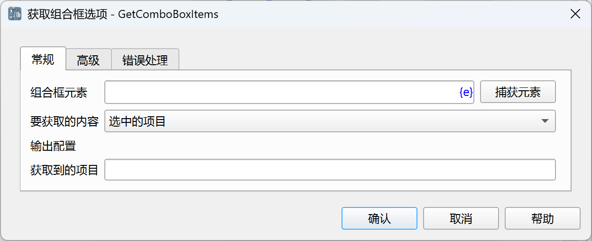
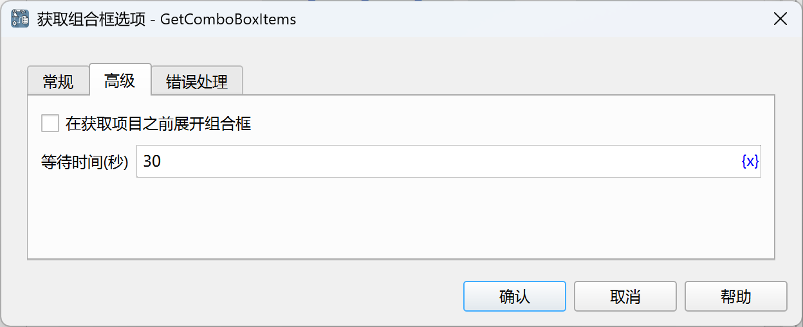

# 获取组合框选项

获取组合框当前选中的或全部的选项。

## 指令配置

### 组合框元素

从元素库中选择一个组合框元素，或者点击“捕获元素”按钮调用工具获取，详情请参考[窗口元素捕获工具](../../../manual/window_element_capture_tool.md)。

### 要获取的内容

- 选中的项目：获取当前选中的项。
- 全部的项目：获取所有项。

### 获取到的项目

输入用于保存获取到的项目列表的变量名。

### 在获取项目之前展开组合框

有些组合框在展开后才能获取到项目，可以勾选此选项，让指令在组合框展开后再获取项目。

### 等待时间

等待窗口元素出现的时间，单位为秒。

### 错误处理

如果指令执行出错，则执行错误处理，详情参见[指令的错误处理](../../../manual/error_handling.md)。
