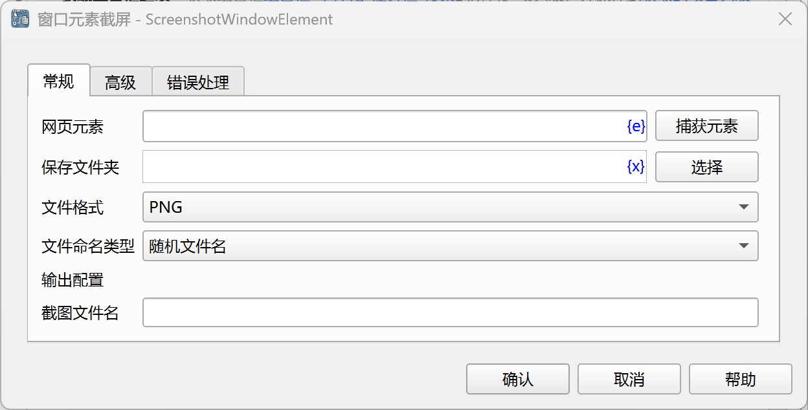
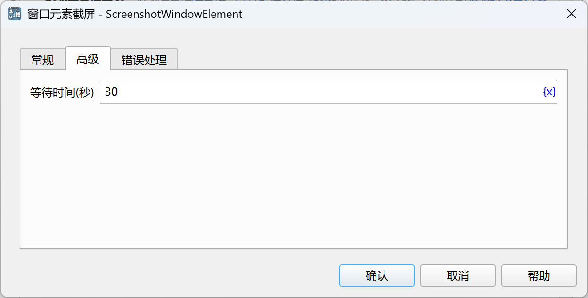

# 窗口元素截屏

获取窗口元素的截屏。

## 指令配置

### 窗口元素

从元素库中选择一个窗口元素，或者点击“捕获元素”按钮调用工具获取，详情请参考[窗口元素捕获工具](../../../manual/window_element_capture_tool.md)。

### 保存文件夹

输入或选择保存截屏文件的文件夹路径。

### 文件格式

选择保存截屏文件的格式，支持 PNG、JPEG 两种格式。

### 文件命名类型

选择文件命名方式，随机文件名或者自定义文件名。

### 自定义文件名

如果选择自定义文件名，则输入自定义文件名。

### 覆盖现有文件

如果选择自定义文件名，则选择是否覆盖同名文件。

### 截图文件名

输入用于保存截图文件路径的变量名。

### 等待时间

等待窗口元素出现的时间，单位为秒。

### 错误处理

如果指令执行出错，则执行错误处理，详情参见[指令的错误处理](../../../manual/error_handling.md)。
