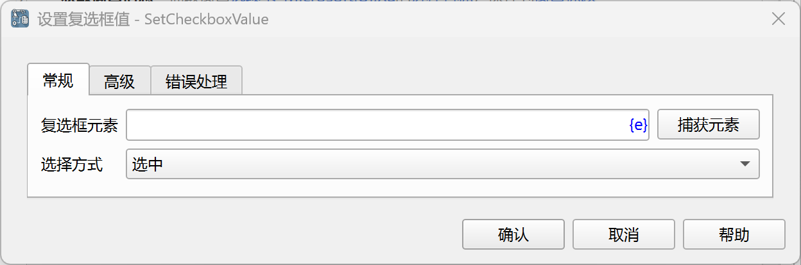
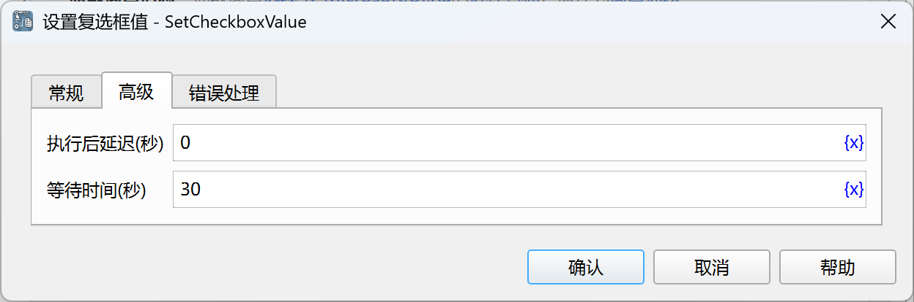

# 设置复选框值

勾选或取消勾选复选框。

## 指令配置

### 复选框元素

从元素库中选择一个复选框元素，或者点击“捕获元素”按钮调用工具获取，详情请参考[窗口元素捕获工具](../../../manual/window_element_capture_tool.md)。

### 选择方式

选择勾选复选框的方式，可选值有：选中、取消勾选、反选。

### 执行后延迟

执行指令后，延迟一段时间再继续执行后续指令，单位为秒。

### 等待时间

等待输入框出现的时间，单位为秒。

### 错误处理

如果指令执行出错，则执行错误处理，详情参见[指令的错误处理](../../../manual/error_handling.md)。
