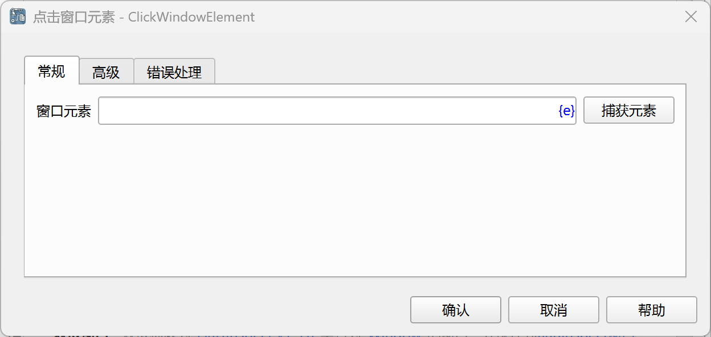
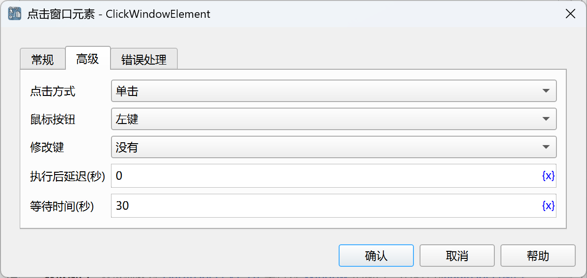

# 点击窗口元素

模拟鼠标点击窗口元素操作，如点击按钮、链接等。

## 指令配置

### 窗口元素

从元素库中选择一个窗口元素，或者点击“捕获元素”按钮调用工具获取，详情请参考[窗口元素捕获工具](../../manual/window_element_capture_tool.md)。

### 点击方式

单击或双击。

### 鼠标按钮

左键、中键、右键。

### 修改键

选择同时按下的修改键，可选值有：没有、Alt、Ctrl、Shift。

### 执行后延迟

执行指令后，延迟一段时间再继续执行后续指令，单位为秒。

### 等待时间

等待窗口元素出现的时间，单位为秒。

### 错误处理

如果指令执行出错，则执行错误处理，详情参见[指令的错误处理](../../manual/error_handling.md)。
