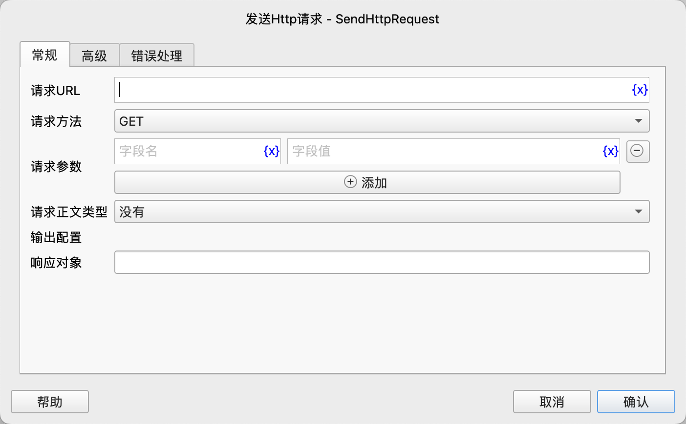
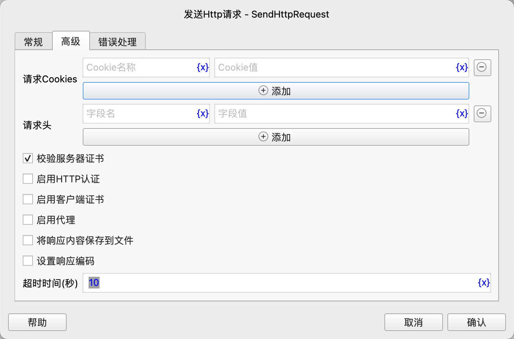

# 发送HTTP请求

发送HTTP请求，并将响应结果保存到流程变量中。

## 指令配置

### 请求URL

输入请求的URL地址，支持HTTP、HTTPS协议，如`https://www.example.com/some/path`。

### 请求方法

选择请求方法，支持`GET`、`POST`、`PUT`、`DELETE`、`OPTIONS`、`HEAD`、`PATCH`。

### 请求参数

填写请求的查询参数。

### 请求正文类型

选择请求正文类型，支持如下选项：

* `没有`：不发送请求正文。
* `附件表单`：发送带附件文件的表单请求。
* `参数表单`：发送不带附件文件的表单请求。
* `JSON数据`：发送JSON格式的请求正文。
* `XML数据`：发送XML格式的请求正文。
* `文本`：发送其他文本格式的请求正文。
* `二进制数据`：发送二进制格式的请求正文。

### 附件表单

如果请求正文类型为`附件表单`，则需要填写附件表单，可以添加文本参数和文件参数。

### 参数表单

如果请求正文类型为`参数表单`，则需要填写参数表单。

### 请求JSON数据

如果请求正文类型为`JSON数据`，则需要填写JSON格式的请求正文。

### 请求XML数据

如果请求正文类型为`XML数据`，则需要填写XML格式的请求正文。

### 请求文本

如果请求正文类型为`文本`，则需要填写文本格式的请求正文。

### 请求文件

如果请求正文类型为`二进制数据`，则需要填写包含请求正文的文件路径。

### 请求Cookies

填写请求的Cookie信息。

### 请求头

填写请求的请求头信息。

### 校验服务器证书

对于HTTPS请求，可以选择是否校验服务器证书，如果选择校验且服务器证书无效，则请求将失败。

### 启用HTTP认证

如果请求需要HTTP认证，则需要选择此项，并填写认证用户名和密码。

### 认证方法

选择认证方法，支持`Basic`和`Digest`两种认证方法。

### 用户名

填写认证用户名。

### 密码

填写认证密码。

### 启用客户端证书

如果请求需要客户端证书，则需要选择此项，并填写证书文件路径和密钥文件路径。

### 客户端证书文件

选择客户端证书文件。

### 客户端密钥文件

选择客户端密钥文件。

### 启用代理

如果请求需要代理，则需要选择此项，并填写代理服务器信息。

### 代理服务器

填写代理服务器的协议、用户名、密码、地址和端口。

### 将响应内容保存到文件

选择是否将响应内容保存到文件，如果选择保存，则需要填写保存文件的路径。

如果选择将响应内容保存到文件，则无法通过响应结果变量获取响应内容，响应结果变量中只保留响应状态码和响应头信息。

### 文件保存目录

选择保存文件的目录，如果目录不存在，则会自动创建该目录。

### 文件名

选择保存文件的名称，如果文件已存在，则会报错。

### 超时时间(秒)

设置请求的连接和读取超时时间，单位为秒，默认10秒。如果在该时间内没有连接成功或读取到响应数据，则请求将失败。

注意，这个并不限制响应数据下载的总时间。

### 响应对象

输入用于保存响应结果的流程变量名称，响应对象中包含以下属性：

* `status_code`：响应状态码。
* `reason`：响应原因。
* `headers`：响应头信息，是一个字典对象。
* `cookies`：响应Cookie信息，是一个字典对象。
* `sessionCookies`：通过`cookies`属性只能获取当前响应返回的Cookie信息， 
如果存在重定向，则无法获取中间响应返回的Cookie信息，这时，可以通过`sessionCookies`属性获取当前存活的所有Cookie信息。
* `text`：响应文本内容。
* `json`：响应JSON数据。
* `content`：响应二进制数据，是一个字节字符串。
* `encoding`：响应文本编码。

### 错误处理

如果指令执行出错，则执行错误处理，详情参见[指令的错误处理](../../manual/error_handling.md)。
