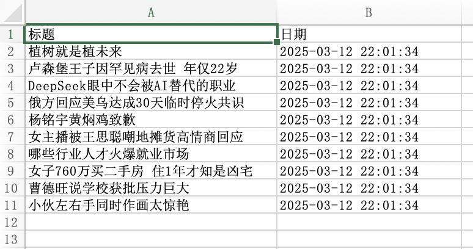

# 采集百度热搜

本示例应用可以采集百度搜索首页的热搜，并保存到Excel文件中。

## 下载

点击[这里](../../examples/collect_baidu_hot_searches.zip)下载应用的zip压缩包。

## 使用

下载应用后，解压到本地目录，然后在JimuFlow中打开应用。

打开应用后，运行主流程main，将显示如下启动参数：

* 数据文件保存目录：输入Excel文件的保存目录。

填写启动参数并启动应用后，应用将自动完成采集工作，并将采集的数据保存到Excel文件中。

## 应用流程说明

本应用的大致流程如下：

1. 创建一个数据表格用于保存采集数据。
2. 打开一个网页浏览器并跳转到百度搜索首页
3. 遍历网页上的所有热搜元素，并将热搜标题保存到数据表格中。
4. 将数据表格导出为Excel文件，并保存到指定目录。

## 相关截图

main流程：

运行日志：

采集数据：

