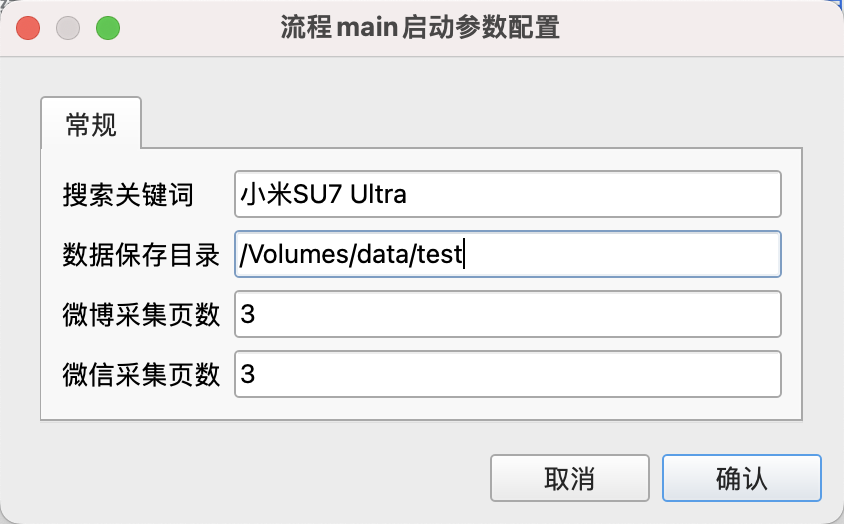
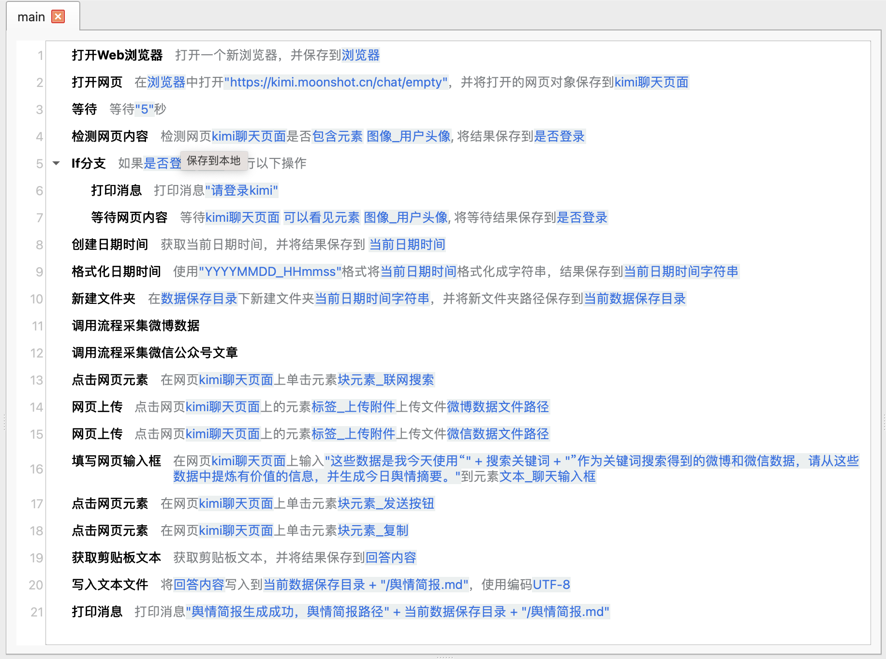
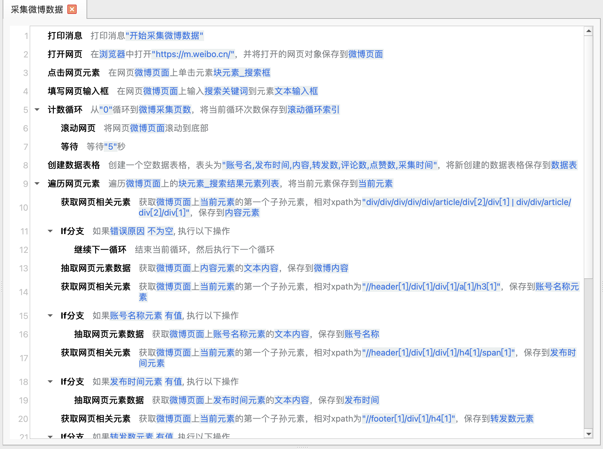
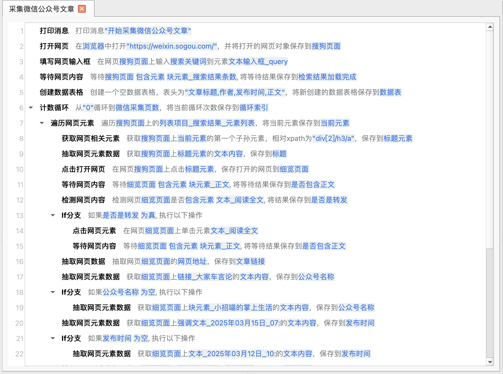
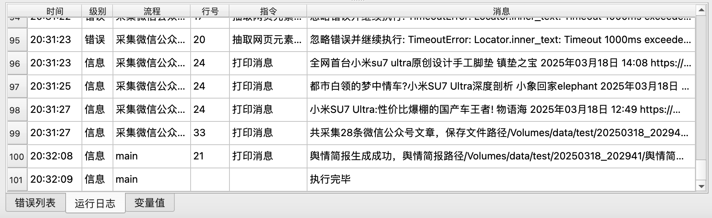
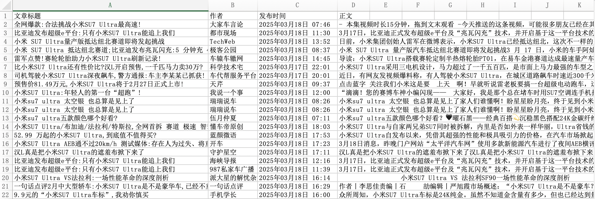
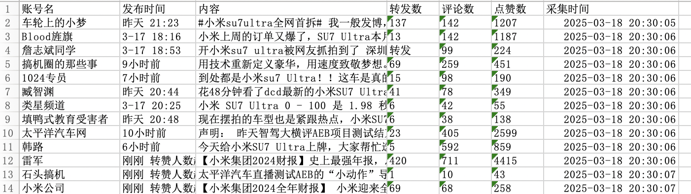
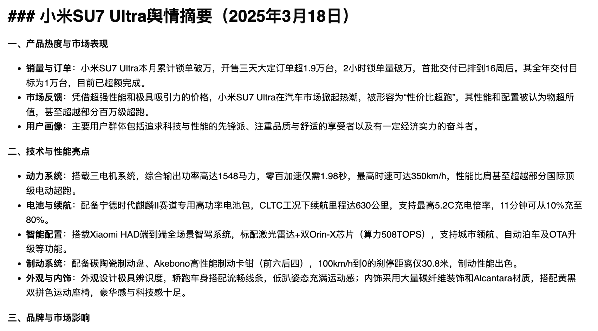

# 制作每日舆情简报

本示例应用可以根据用户提供的关键词，采集微博数据和微信公众号文章，然后调用Kimi AI助手网页版生成舆情简报。

## 下载

点击[这里](../../examples/make_public_opinion_daily.zip)下载应用的zip压缩包。

## 使用

下载应用后，解压到本地目录，然后在JimuFlow中打开应用。

打开应用后，运行主流程main，将显示如下启动参数：

* 搜索关键词：输入搜索的关键词。
* 数据保存目录：输入用于保存数据的目录。
* 微博采集页数：输入采集微博数据的页数，默认3页。
* 微信采集页数：输入采集微信文章数据的页数，默认3页。

应用启动后将打开一个浏览器并跳转到Kimi AI助手网页，用户需要手动完成登录，登录成功之后，用户就可以不用管了，应用将自动完成剩余工作。

运行结束后，用户可以从数据保存目录下找到采集的数据以及生成的舆情简报。

注意：如果采集数据量较大，搜狗微信可能会弹出验证码，用户需要手动输入验证码。

## 应用流程说明

本应用的大致流程如下：

1. 通过 https://m.weibo.cn/ 搜索并采集微博数据，然后保存到Excel文件中。
2. 通过 https://weixin.sogou.com/ 搜索并采集微信文章数据，然后保存到Excel文件中。
3. 将Excel文件上传到Kimi AI助手网页版，然后调用Kimi AI助手网页版生成舆情简报。

## 相关截图

main流程：

采集微博数据子流程：

采集微信公众号文章子流程：

运行日志：

微信采集数据：

微博采集数据：

生成的最终舆情简报：

点击[这里](report.md)查看生成的完整报告样例。
