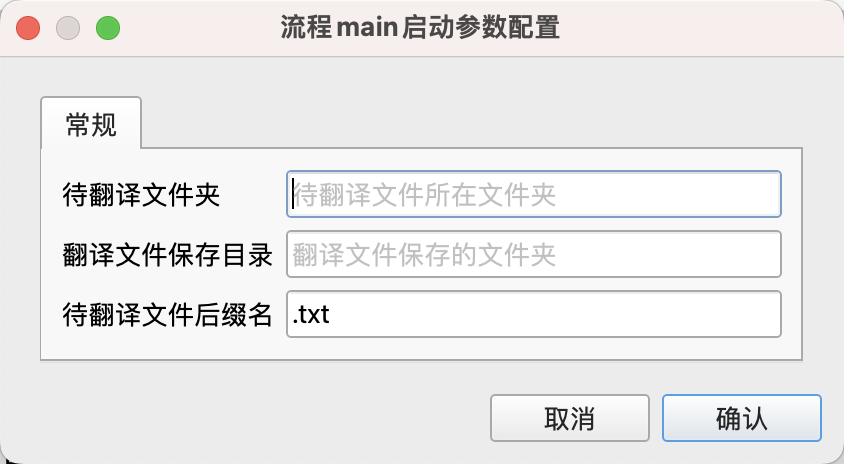
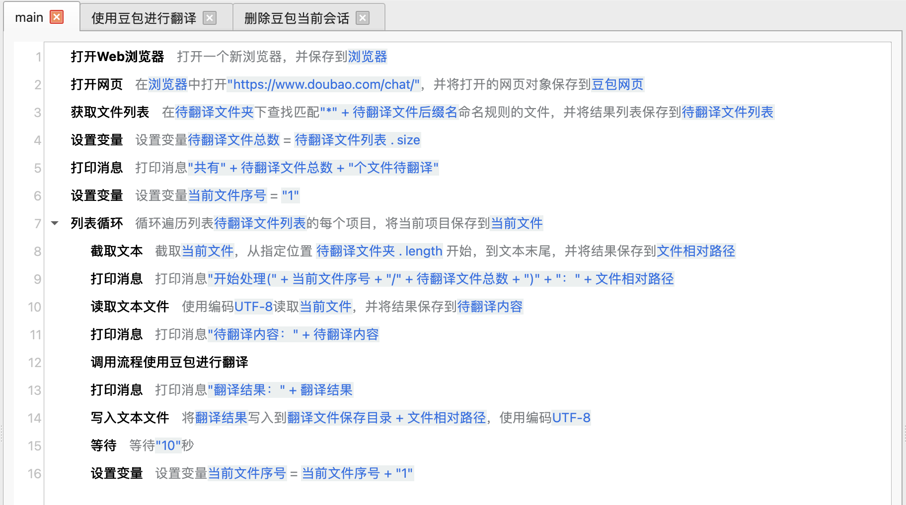
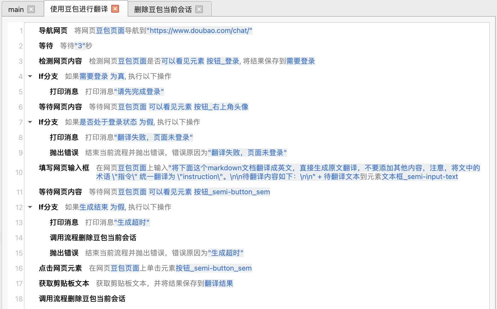
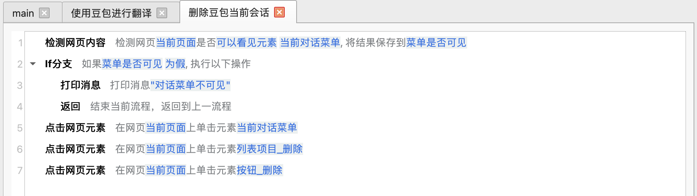
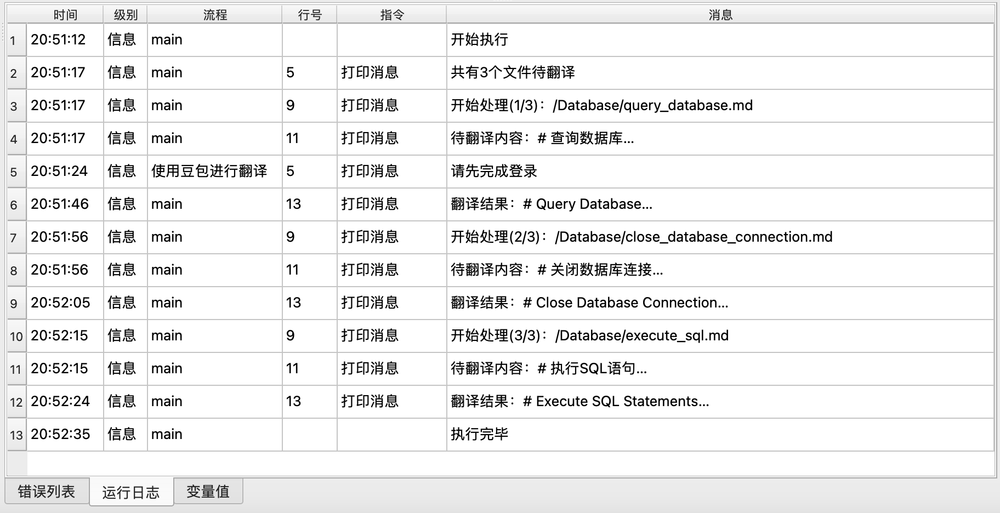

# 使用大模型批量翻译文本文件

本示例应用实现了使用[豆包网页版](https://www.doubao.com/chat/)批量翻译文本文件的功能。

## 下载

点击[这里](../../examples/translate_text_files.zip)下载应用的zip压缩包。

## 使用

下载应用后，解压到本地目录，然后在JimuFlow中打开应用。

打开应用后，运行主流程main，将显示如下启动参数：

* 待翻译文件夹：输入待翻译文件所在的文件夹路径。
* 翻译文件保存目录：输入翻译文件保存的目录路径。
* 待翻译文件后缀名：输入待翻译文件的后缀名，默认为“.txt”。

应用启动后将打开一个浏览器并跳转到豆包网站，用户需要手动完成登录，登录成功之后，用户就可以不用管了，应用将自动完成剩余工作。

翻译过程中可以将浏览器切换到后台，然后用户可以在电脑上进行其他工作。

## 应用流程说明

本应用的大致流程如下：

1. 打开一个网页浏览器，并跳转到豆包聊天页面。
2. 从待翻译文件夹下及其所有子文件夹下，查找所有指定后缀名的文件，并保存到待翻译文件列表中。
3. 遍历待翻译文件列表中的文件，并进行如下处理：
    1. 在豆包聊天页面上打开一个新对话。
    2. 检查是否登录，如果没有登录，提示用户进行登录，并等待用户登录。
    3. 将翻译指令和待翻译文件内容发送到豆包，并等待豆包返回翻译结果。
    4. 从网页中提取翻译结果。
    5. 删除当前对话，避免干扰其他对话。
    6. 获取翻译文件相对于待翻译文件夹的路径，然后将翻译结果保存到翻译文件保存目录的相同路径下。

如果翻译过程中出现错误，流程将自动重试，重试次数为100次，重试间隔为60秒。如果重试之后仍然出错，流程将结束运行。

## 相关截图

main流程：

翻译子流程：

删除对话子流程：

运行日志（批量翻译markdown文档）：

