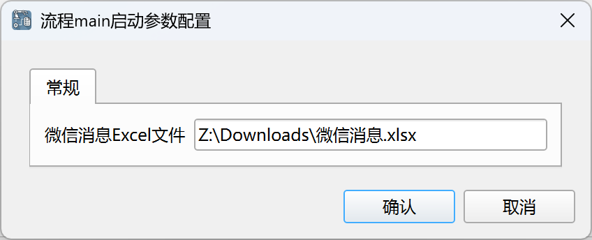
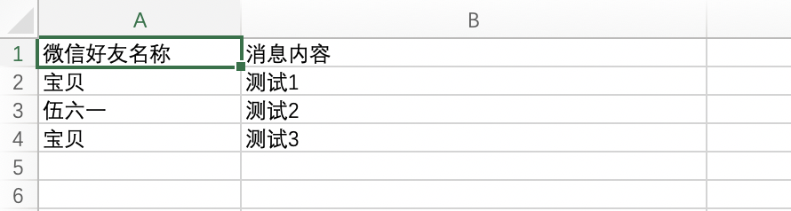
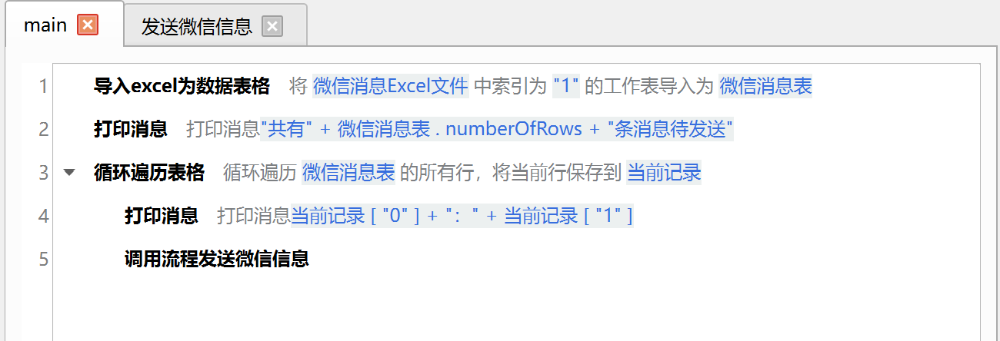
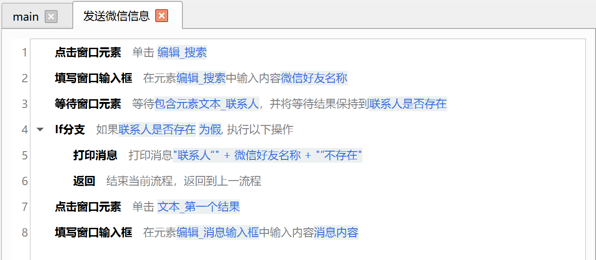
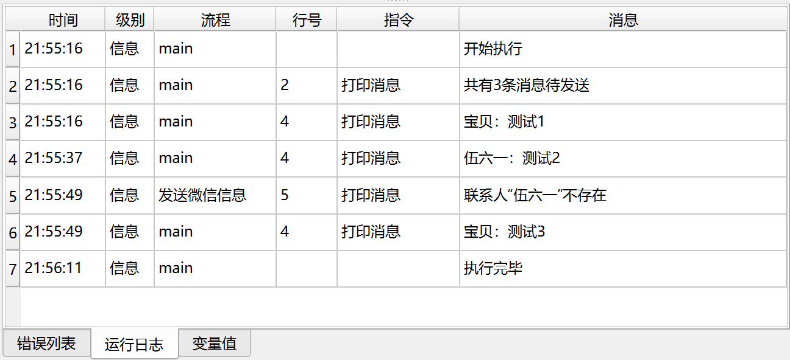

# 微信批量发信息

本示例应用实现了微信批量发信息的功能。

## 下载

点击[这里](../../examples/wechat_send_message.zip)下载应用的zip压缩包。

## 使用

下载应用后，解压到本地目录，然后在JimuFlow中打开应用。

打开应用后，运行主流程main，将显示如下启动参数：

* 微信消息Excel文件：输入消息配置文件的路径。

在启动应用之前，请先启动微信并完成登录。

消息配置文件需要包含两列，第一列为微信好友名称，第二列为消息内容，如下所示：

## 应用流程说明

本应用的大致流程如下：

1. 读取Excel文件，获取消息配置信息。
2. 循环遍历消息配置信息，依次发送消息。

## 相关截图

main流程：

发送微信消息子流程：

运行日志：

