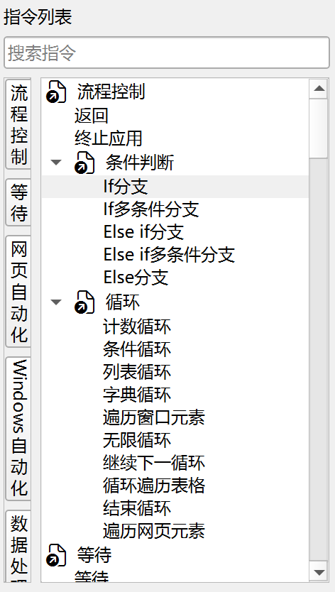

# 界面功能介绍

## 主界面

启动JimuFlow后即可进入主界面。

## 菜单栏

菜单栏中包含了文件、编辑、运行、帮助等菜单。

文件菜单：

- 新建应用：新建一个RPA应用。
- 打开应用：打开一个RPA应用。
- 配置应用：修改当前RPA应用的配置信息。
- 最近使用的应用：可以查看并打开最近使用过的RPA应用。
- 新建流程：在当前应用中新建一个流程。
- 配置流程：修改当前流程的配置信息。
- 保存流程：保存当前流程。
- 删除流程：删除当前流程。

编辑菜单：

- 撤销：撤销上一步操作。
- 重做：重做上一步操作。

运行菜单：

- 运行流程：运行当前流程。
- 调试流程：调试当前流程。
- 继续执行：在调试中，继续执行直到下一个断点。
- 步过：在调试中，执行当前语句，然后暂停。
- 步入：在调试中，进入子流程，并在第一条语句处暂停。
- 步出：在调试中，跳出当前子流程，并在父流程的下一条语句处暂停。
- 停止流程：停止当前流程的运行或调试。

帮助菜单：

- 关于JimuFlow：显示关于信息。
- 设置：设置JimuFlow的配置信息。
- 帮助：显示帮助信息。

## 工具栏

工具栏中包含一些常用的操作，如下所示：

## 新建应用

新建应用时，将打开新建应用对话框，如下所示：

新建应用对话框包含如下字段：

- 名称空间：名称空间用于区分由不同人编写的同名流程，使用类似于反向域名的格式，如foo，foo.bar。名称空间的每一部分由除了标点符号之外的非空白符和下划线组成，总长度不能超过100个字符。
- 应用名称：由除了标点符号之外的非空白符和下划线组成，总长度不能超过100个字符。
- 应用版本：使用英文句号分割的数字来表示，如1、1.0、1.0.0，总长度不能超过50个字符。
- 保存目录：保存应用目录的父目录。

## 配置应用

配置应用时，将打开配置应用对话框，如下所示：

在该对话框上可以修改应用的名称空间、应用名称和应用版本。

## 新建流程

新建流程时，将打开新建流程对话框，如下所示：

新建流程对话框包含如下字段：

- 流程名称：可以使用任意除了标点符号之外的非空白符和下划线，长度不超过100个字符。

## 配置流程

配置流程时，将打开配置流程对话框，如下所示：

在该对话框上可以修改流程的名称。

## 流程列表

流程列表包含了当前应用的所有流程，如下所示：

流程列表的顶部包含一个搜索框，当流程较多时可以通过搜索快速定位流程。

每个应用都有一个主流程，名称前面有一个房子图标，默认名称为`main`，当执行应用时，会从主流程开始执行。

双击流程名称，可以打开流程编辑界面。右键流程名称，将打开流程操作菜单，包含打开、配置、删除、设置主流程等操作。

## 指令列表

指令列表显示了JimuFlow提供的所有指令，如下所示：

当前包含了流程控制、等待、网页自动化、Windows自动化、数据处理、操作系统、鼠标键盘、数据表格、其他等9大类指令。

另外，指令列表的流程分类下还显示了当前应用的所有流程，流程也是一种指令，可以像其他指令一样使用。

双击指令可以将流程添加到当前流程的最后一行，如果指令需要配置，将打开指令配置对话框，也可以通过拖拽将指令添加到流程的指定位置。
选中流程后按F1键将显示指令的帮助信息。

指令列表的顶部包含一个搜索框，可以通过搜索快速定位指令。

## 流程编辑器

流程编辑器用于编辑流程包含的指令，如下所示：

流程包含的指令以树形结构展示，每个指令节点支持如下操作：

- 添加指令：双击指令列表中的指令或将指令拖拽到流程编辑器中。
- 修改指令配置：双击指令可以打开指令配置对话框。
- 删除指令：选中指令，按退格键或Delete键删除，也可以右键指令，选择删除。
- 复制指令：选中指令，按Ctrl+C复制，也可以右键指令，选择复制。
- 粘贴指令：按Ctrl+V粘贴到流程末尾，或者右键指令，选中粘贴在当前指令的前面、里面或后面。
- 剪切指令：选中指令，按Ctrl+X剪切，也可以右键指令，选择剪切。
- 添加断点：右键指令，选择添加断点。
- 移动指令：可以通过拖拽指令进行移动。

## 错误列表

错误列表用于显示所有打开流程中包含的错误信息，如下所示：

错误信息包含流程名称、行号、错误等字段，双击错误信息将跳转到对应的流程和行号。

## 运行日志

运行日志用于显示当前运行流程的日志信息，如下所示：

运行日志包含时间、级别、流程、行号、指令、消息等字段，双击日志信息将跳转到对应的流程和行号。

## 变量值

变量值用于查看当前调试流程的调用堆栈以及关联的实时变量信息，如下所示：

## 变量面板

变量面板用于管理当前流程的变量，如下所示：

### 添加变量

点击添加变量按钮，将打开添加变量对话框，如下所示：

变量具有如下属性：

- 变量名称：可以使用任意除了标点符号之外的非空白符和下划线，长度不超过50个字符。
- 变量类型：变量类型可以是文本、数值、布尔、列表、字典、数据表格、日期、时间等。
- 变量方向：可选值有输入变量、输出变量、本地变量。输入变量用于接受用户或者父流程传递进来的参数，输出变量用于向用户或父流程传递处理结果，本地变量用于在流程中临时存储数据。
- 默认值：为输入变量配置默认值，当前只支持为文本、数值、布尔类型的变量配置默认值。
- 输入控件标签：为输入变量或输出变量配置在流程配置对话框中显示的字段标签。
- 输入控件分组：输入变量所属的流程配置对话框的配置分组，流程配置对话框中将输入变量分成了常规和高级两个分组。
- 必填项：输入变量是否必填。
- 输入控件排序号：输入变量在流程配置对话框中的排序号。
- 输入控件类型：输入变量的输入控件类型，每种变量类型对应的输入控件类型不同，如文本类型可以使用文本输入框、多行文本输入框、下拉框、表达式输入框、变量输入框、自定义输入框等，布尔类型可以使用表达式输入框、复选框、自定义输入框等。
- 输入控件提示：输入变量或输出变量的输入控件提示信息。
- 输入控件帮助信息：输入变量或输出变量的输入控件帮助信息。
- 输入控件依赖项：该输入变量是否依赖与其他变量，如果依赖其他变量，则只有当依赖的变量满足条件时，该变量才会显示。
- 输入选项列表：为下拉框输入控件配置选项列表。
- 自定义输入控件：配置自定义输入控件的组件名。

### 删除变量

点击删除变量按钮，将删除选中的变量。

## 元素库

元素库用于管理当前应用的网页元素和窗口元素，如下所示：

点击捕获元素按钮，将打开捕获元素工具，具体请参见[网页元素捕获工具](web_element_capture_tool.md)和[窗口元素捕获工具](window_element_capture_tool.md)。

## 资源库

资源库用于管理流程指令中使用的图片等文件资源，如下所示：

