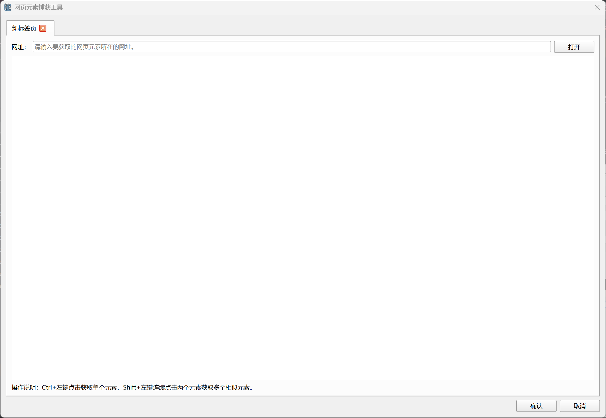
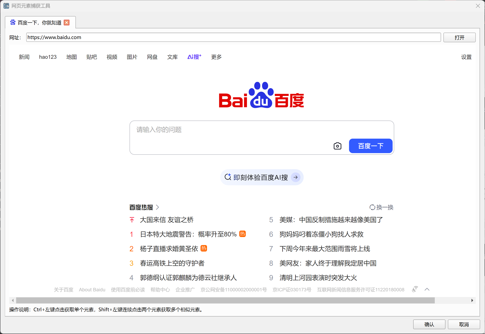
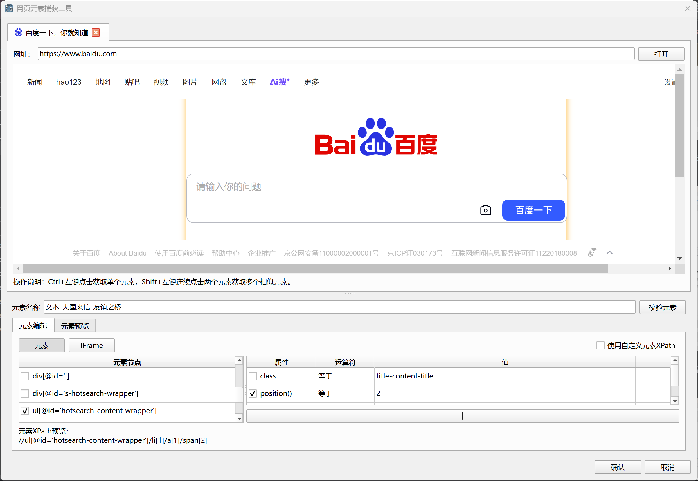
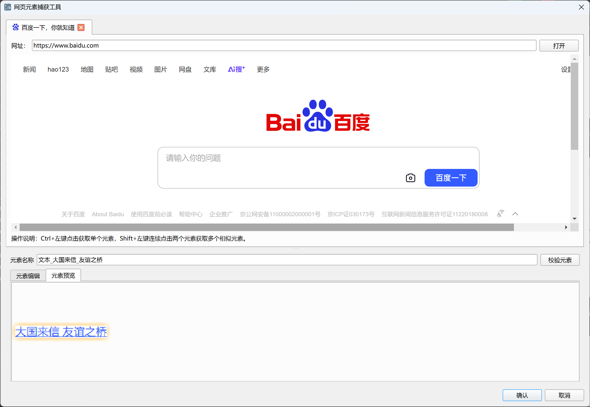

## 网页元素捕获工具

该工具用于捕获和编辑网页元素，然后保存到元素库中。

捕获界面如下：

打开之后，在上方的网址框中输入网页元素所在的网址，然后点击“打开”按钮，工具将打开该网页，如下所示：

Ctrl+左键点击获取单个元素，Shift+左键连续点击两个元素获取多个相似元素。

捕获完成后将显示如下编辑界面：

捕获的网页元素使用IFrame XPath路径和元素XPath路径进行定位， 
IFrame XPath路径用于定位元素所在的IFrame对象，如果元素不在IFrame中，则IFrame XPath路径为空。
元素XPath路径用于在窗口对象中定位元素对象。

上述编辑界面中将显示捕获元素的IFrame XPath路径和元素XPath路径，用户可以根据需要进行调整编辑。

用户还可以通过Ctrl+左键或Shift+左键重新捕获元素，或者点击“校验元素”按钮在当前网页中查找并高亮显示匹配的元素，以校验元素是否正确。

点击元素节点可以在当前网页中查找并高亮显示对应的元素。

元素预览界面可以查看元素的截图，如下所示：

编辑完成后，点击“确认”按钮，元素将保存到元素库中，如有需要，后续还可以在元素库中对元素进行编辑操作。
