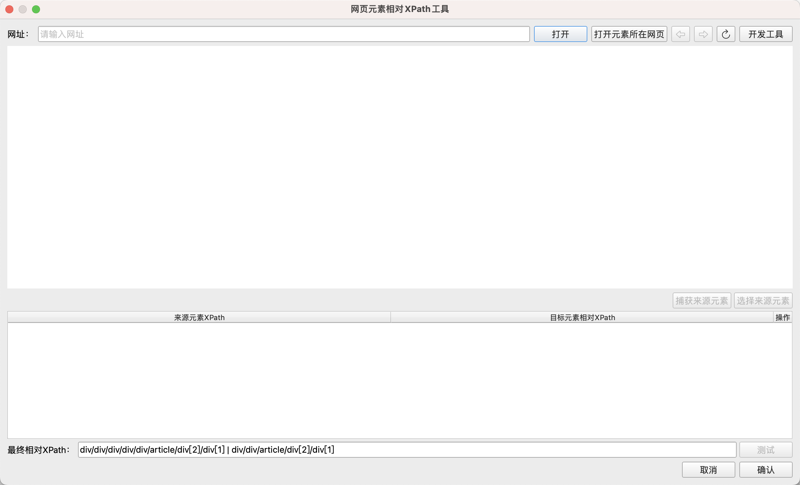

# 网页元素相对XPath工具

在[获取网页相关元素](../commands/WebAutomation/WebElementOperation/get_relative_web_element.md)指令中，如果需要定位子孙元素，
则需要配置子孙元素相对于父元素的相对XPath路径，通过该工具可以快速获取相对XPath路径。

## 使用方法

在指令的配置对话框中点击“获取相对XPath”按钮，可以打开该工具，如下所示：

输入目标网页的网址并点击`打开`按钮，将打开目标网页，
也可以点击`打开元素所在网页`按钮，从元素库中选择一个网页元素，并打开捕获该元素时的网页地址。

打开目标网页后，可以点击`捕获来源元素`按钮，然后Ctrl+左键点击捕获来源元素，捕获的来源元素将被添加到下方的表格中，如下所示：

捕获来源元素后，点击表格中来源元素对应的那一行的`捕获目标元素`按钮，然后Ctrl+左键点击捕获目标元素，工具将自动生成目标元素相对于来源元素的XPath表达式，
并填入当前行的“目标元素相对XPath”列，如下所示：

点击`删除`按钮，可以删除当前行的来源元素和目标元素。

对于目标元素在来源元素中位置不固定的情况，可以捕获并添加多个来源元素，然后生成多个相对XPath表达式，
工具将把这些XPath表达式合并成一个XPath表达式，最终的XPath表达式将显示在底部的输入框中，如下所示：

本工具还提供了测试功能，点击最终XPath输入框后面的`测试`按钮，将打开选择元素对话框，用户可以选择一个用于测试的来源元素或元素列表，
工具将在当前网页中查找所有匹配的来源元素和目标元素并高亮显示，用户可以检查是否所有来源元素和目标元素都被高亮显示。

添加来源元素时，除了可以直接通过捕获元素进行添加外，还可以通过点击表格右上方的`选择来源元素`按钮，从元素库中选择一个来源元素和元素列表进行添加。

另外，工具顶部的工具栏中还有一个`开发工具`按钮，可以打开Chrome开发者工具，方便用户查看网页元素。

当获取到相对XPath表达式后，可以点击右下角的`确认`按钮，将该相对XPath表达式添加到指令的配置对话框中，并关闭该工具。
也可以点击`取消`按钮直接关闭该工具。
