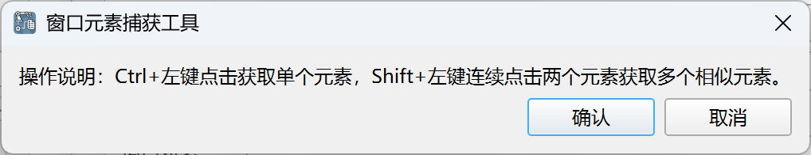
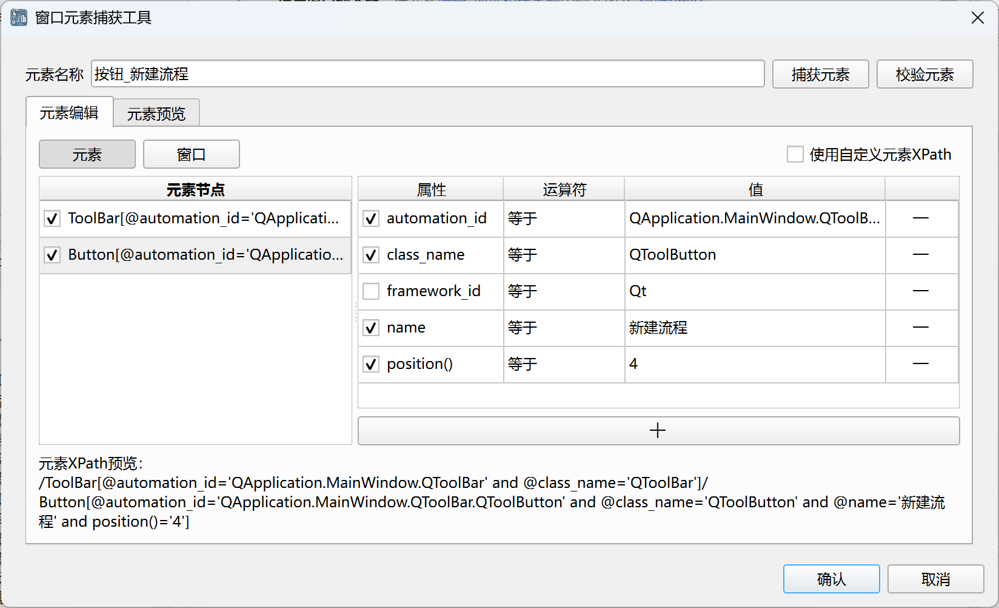
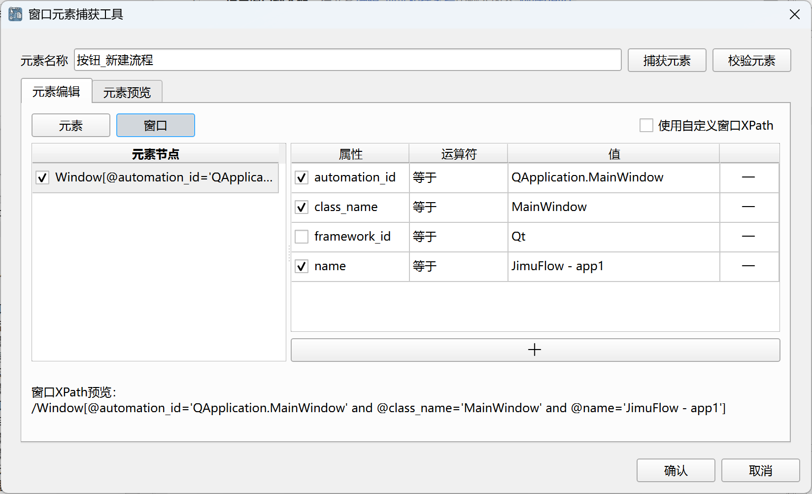
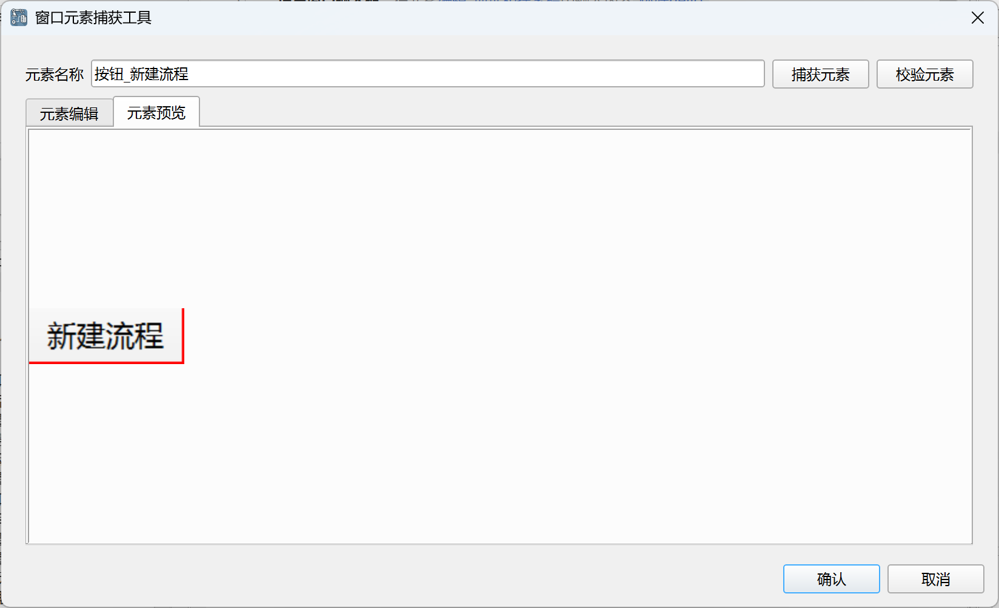

## 窗口元素捕获工具

该工具用于捕获和编辑窗口元素，然后保存到元素库中。

捕获界面如下：

Ctrl+左键点击获取单个元素，Shift+左键连续点击两个元素获取多个相似元素。

捕获完成后将显示如下编辑界面：

捕获的窗口元素使用窗口XPath路径和元素XPath路径进行定位， 
窗口XPath路径用于定位元素所在的窗口对象，
元素XPath路径用于在窗口对象中定位元素对象。

上述编辑界面中将显示捕获元素的窗口XPath路径和元素XPath路径，用户可以根据需要进行调整编辑。

用户还可以点击“捕获元素”按钮重新捕获元素，或者点击“校验元素”按钮在当前所有窗口中查找并高亮显示匹配的元素，以校验元素是否正确。

元素预览界面可以查看元素的截图，如下所示：

编辑完成后，点击“确认”按钮，元素将保存到元素库中，如有需要，后续还可以在元素库中对元素进行编辑操作。