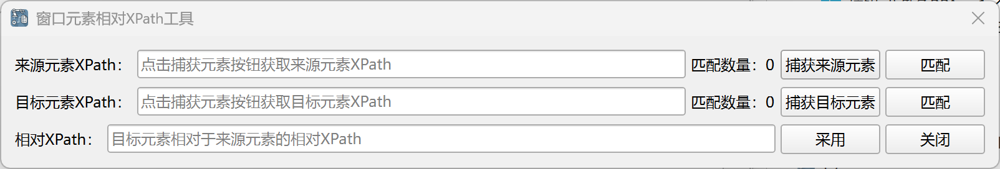

# 窗口元素相对XPath工具

在[获取相关窗口元素](../commands/WindowsAutomation/WindowElementOperation/get_relative_window_element.md)指令中，如果需要定位子孙元素，
则需要配置子孙元素相对于父元素的相对XPath路径，通过该工具可以快速获取相对XPath路径。

## 使用方法

在指令的配置对话框中点击“获取相对XPath”按钮，可以打开该工具。

点击“捕获来源元素”按钮，然后Ctrl+左键点击捕获来源元素。

然后点击“捕获目标元素”按钮，然后Ctrl+左键点击捕获目标元素。

当定位完来源元素和目标元素之后，工具将自动生成目标元素相当于来源元素的XPath表达式，然后点击“采用”按钮，
该XPath表达式将被填入指令的配置对话框中，并且工具将关闭。
